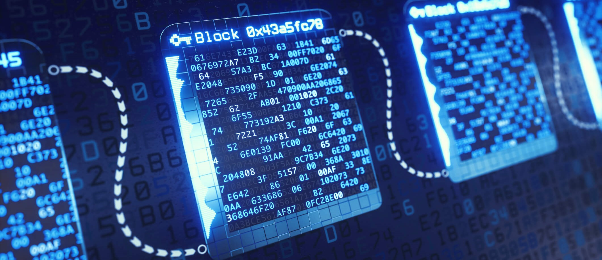

# Blockchain - V2 Project

## Project Overview

The **Blockchain - V2** project is an enhanced decentralized blockchain system designed to integrate **Artificial Intelligence (AI)** for optimization and analysis. It expands upon the **Blockchain - V1**, which primarily focused on building the core functionalities like peer-to-peer networking, block validation, and synchronization.

This version introduces cutting-edge features such as **AI optimization** for energy consumption, **smart contract automation**, and **predictive analytics** for blockchain behavior.

## Timeline: Blockchain Versions

### Blockchain - V2 (Current Version)

- **Key Features**:
  - Integration of **AI** for energy consumption optimization.
  - Implementation of **smart contracts** for transaction automation.
  - **Predictive analytics** using machine learning models.
  - Optimized **consensus mechanisms** (e.g., Proof of Stake).
  - Scalability improvements for supporting decentralized applications (dApps).

### Blockchain - V1 (Previous Version)

- **Key Features**:
  - **Peer-to-peer (P2P) network** with decentralized nodes.
  - **Block creation and validation** mechanism based on a standard consensus protocol.
  - **Peer synchronization** and management for a stable network.
  - Core blockchain functionality: adding blocks to the chain, validating transactions, and maintaining consistency across nodes.

## V2 Features

### AI Integration

The AI component focuses on optimizing the blockchain's energy consumption by analyzing the network's behavior and predicting future resource needs. This feature aims to reduce the energy consumption of **Proof of Work** or **Proof of Stake** processes by adapting the network's behavior intelligently.

### Smart Contracts

In **V2**, smart contracts will automate transactions and enforce rules within the blockchain, eliminating the need for intermediaries. These contracts will be used for various applications, such as token transfers, agreements, and conditional execution.

### Consensus Mechanism Optimization

The V2 blockchain introduces a more energy-efficient consensus mechanism that could be based on **Proof of Stake (PoS)** or a **hybrid model** with AI-driven decision-making to adjust parameters based on network demand.

### Predictive Analytics

AI models will analyze transaction data and blockchain metrics to predict network congestion, energy spikes, and potential security risks. This will help in proactive decision-making for optimizing blockchain performance.